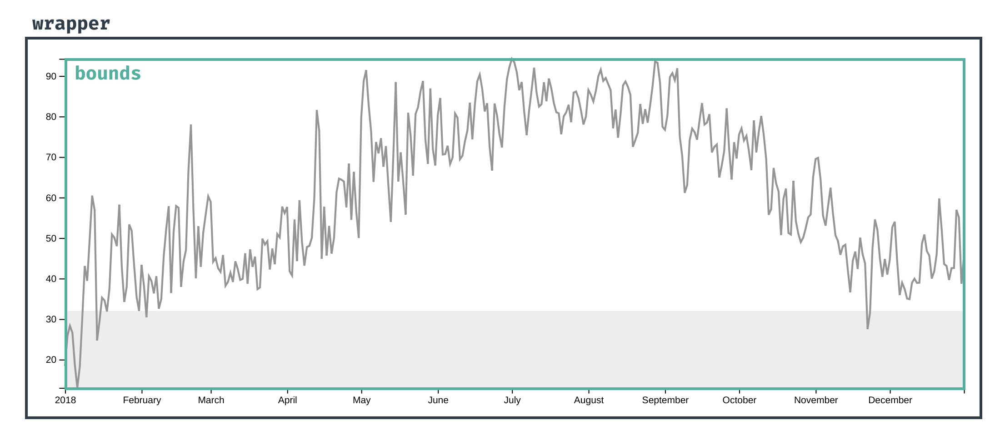
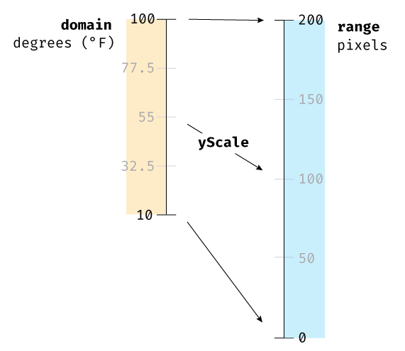

# D3로 2021~2022 기온 그래프 그려보기

[날씨 데이터 출처](https://data.kma.go.kr/climate/RankState/selectRankStatisticsDivisionList.do?pgmNo=179)
[강의 링크](https://www.newline.co/fullstack-d3)

## Accessor function

```js
const xAccessor = (d) => d.date;
```

> 데이터셋이 테이블이라면, 데이터는 열임.

- 바꾸기 쉬움
- 문서화 역할
  - 프레이밍

> 주의사항 ! 데이터 읽어올 때, 단위 잘 변환해줘야 함. 텍스트로 계산되어도 그래프가 그려짐

## Wrapper and Bounds

axis,label등을 위한 공간과 데이터 플롯을 위한 공간의 분리.


아래와 같이 위치 결정.

```js
const bounds = wrapper
  .append("g")
  .style(
    "transform",
    `translate(${dimensions.margin.left}px,${dimensions.margin.top}px)`
  );
```

- Wrapper
  축, 범례, 라벨, 데이터 등 모든 svg 포함.

- bounds
  데이터만 포함. 이 경우는 선 그래프

- dimensions 객체
  해당 객체를 이용하여 bounds의 크기를 계산한다.

```js
let dimensions = {
  width: window.innerWidth * 0.9,
  height: 400,
  margin: {
    top: 15,
    right: 15,
    bottom: 40,
    left: 60
  }
};

dimensions.boundedWidth =
  dimensions.width - dimensions.margin.left - dimensions.margin.right;
dimensions.boundedHeight =
  dimensions.height - dimensions.margin.top - dimensions.margin.bottom;
```

## d3 셀렉터

```js
d3.select();
```

`document.querySelectorAll()`처럼 사용 가능.

## SVG

svg는 디폴트 크기로 300x150(px)을 갖고 있음
일반 돔 요소와 달리 크기 조절이 까다로움.
아래와 같이 `dimensions`객체를 이용한다.

```js
const wrapper = d3
  .select("#wrapper")
  // _groups 필드 안에 배열로 존재함.
  /*
  Selection {_groups: Array(1), _parents: Array(1), constructor: Object, select: ƒ $csb__default(), selectAll: ƒ $csb__default()…}
  _groups: Array(1)
  0: Array(1)
  0: 
  <svg></svg>
  _parents: Array(1)
  */
  .append("svg")
  .attr("width", dimensions.width)
  .attr("height", dimensions.height);
```

## scale

x는 정의역, y는 공역
단위 변환도 필요함.


**SVG y 값은 위에서 아래로 계산됨. range 부분 뒤집어줌.**

```js
const yScale = d3
  .scaleLinear() // 비례 스케일
  .domain(d3.extent(dataset, yAccessor)) // y 수치를
  .range([dimensions.boundedHeight, 0]); // 픽셀 범위에 매핑. dimensions.boundedHeight로 마진 제외한 범위!
```

> attribute는 style보다 우선 순위가 낮기 때문에 덮어쓸 수 있다. d3를 이용한 스타일링은 attr을 사용

## 선 긋기

svg 요소는 기본적으로 검은색 채우기와 획 없음
